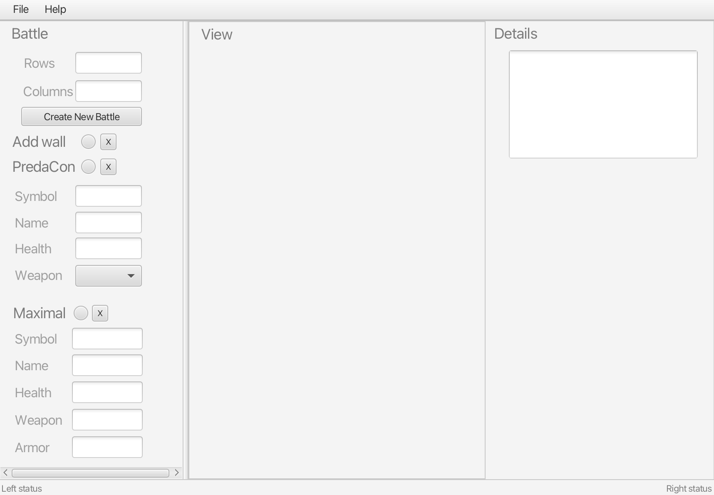

# java-battle-map-editor

Course project in Java with JavaFX.  
A 2D Battle Map Editor prototype: create a grid world, add/remove walls and robots (PredaCons and Maximals), validate input, and save/load maps from file.

---

## Information
This project is a JavaFX GUI application developed to simulate a game world that contains Robots, Walls, and empty spaces.

**Author:** Maryna Hez   
**Date:** April 8, 2025  

---

## Features
The user can open the GUI and create any world by being able to:
- set the size of rows and columns;
- add PredaCon Robot or Maximal Robot;
- add the symbol, name, weapon, and weapon strength for any robot;
- choose where robots are placed on the map;
- view the world in a 2D grid and easily make corrections;
- delete anything (robots, walls, or even the entire world) at any time.

The program updates the status bar at the bottom about user actions and errors.  
Additionally, the user can load or save any world with robots.

---

## How to Run
1. Open the project in IntelliJ IDEA or any IDE that supports JavaFX.
2. Configure JavaFX properly (recommended: JavaFX version 23.0.2).
3. Run the `Main.java` file.
4. The GUI will open.

---

## How to Interact
- Set the number of rows and columns for the world.
- Add walls by clicking on any free cell in the 2D grid.
- Configure PredaCon or Maximal parameters and add them by clicking on a cell.
- Edit or remove any entity by selecting "X" or updating values.
- View detailed information about selected robots in the "Details" panel.
- Save/load worlds or quit the application from the **File** menu.
